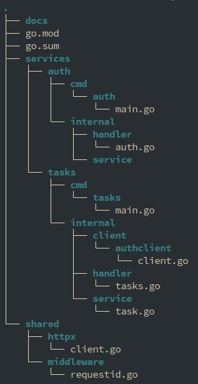
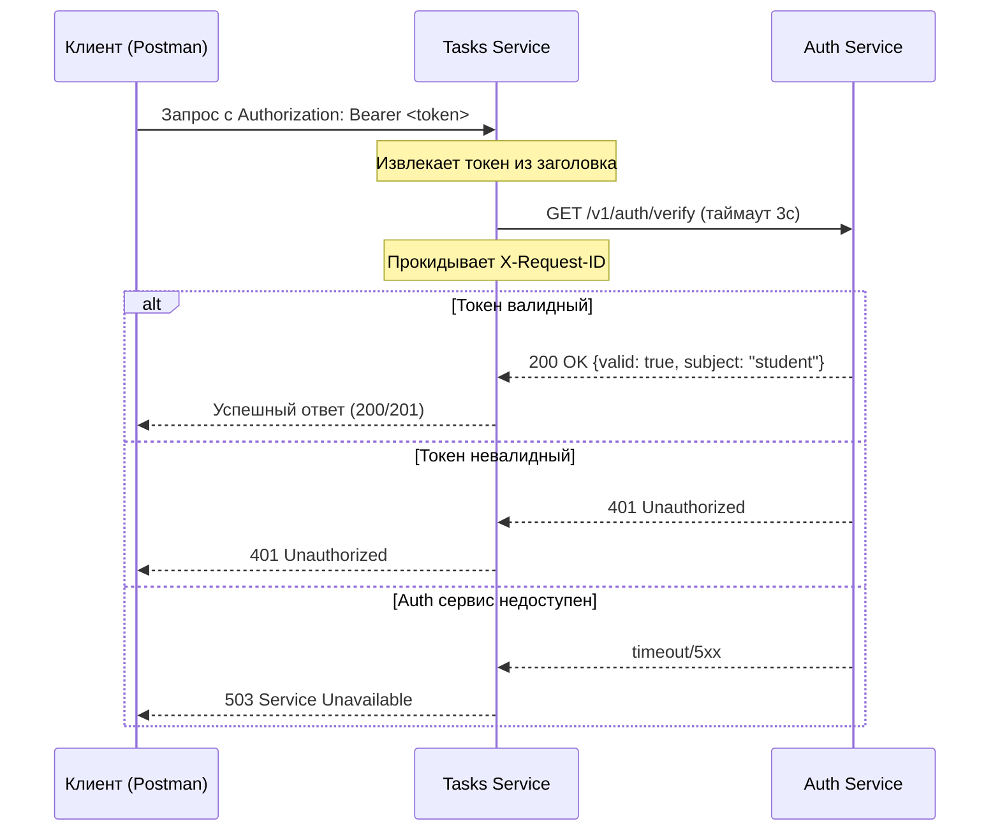
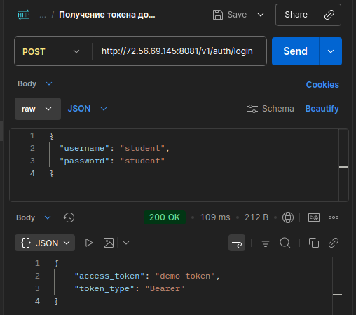
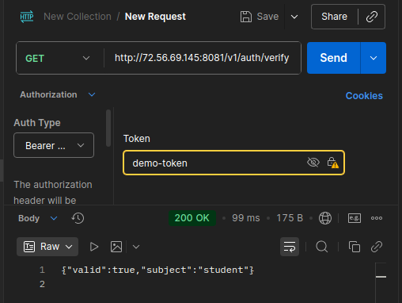
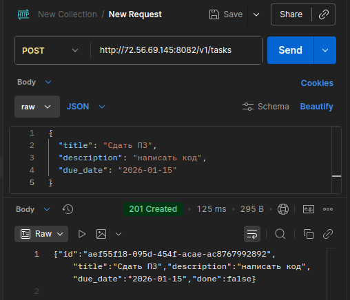
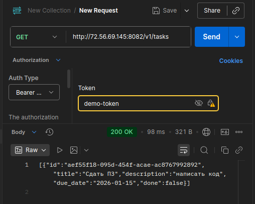
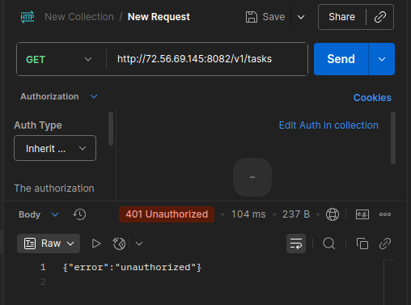

## Практическое занятие №1: Микросервисная архитектура на Go

### Выполнил: Студент ЭФМО-02-25 Пягай Даниил Игоревич

##  О проекте

Проект представляет собой учебную реализацию микросервисной архитектуры, состоящей из двух сервисов:

- **Auth Service** — сервис аутентификации и проверки токенов
- **Tasks Service** — сервис управления задачами (CRUD)

Основная цель — демонстрация взаимодействия между микросервисами через HTTP с использованием таймаутов, проброса request-id и корректной обработки ошибок.

---

## Структура



---

## 🏗 Архитектура

### Границы сервисов

**Auth Service** (порт `8081`)
- Аутентификация пользователей
- Выдача токенов
- Проверка валидности токенов
- Упрощенная логика: `student/student` → `demo-token`

**Tasks Service** (порт `8082`)
- CRUD операции с задачами
- Проверка токенов через Auth Service
- In-memory хранилище с потокобезопасным доступом
- Таймаут запросов к Auth: 3 секунды

### Схема взаимодействия



### Список эндпоинтов

#### Auth Service (gRPC, порт 50051)

| Метод | Запрос | Ответ | Описание |
|-------|--------|-------|----------|
| `Verify` | `{ token }` | `{ valid, subject }` | Проверка токена |

#### Tasks Service (HTTP, порт 8082)

| Метод | Путь | Описание |
|-------|------|----------|
| `GET` | `/tasks` | Список задач |
| `GET` | `/tasks/{id}` | Задача по ID |
| `POST` | `/tasks` | Создать задачу |
| `PATCH` | `/tasks/{id}` | Обновить задачу |
| `DELETE` | `/tasks/{id}` | Удалить задачу |

### Проверка запросов POSTMAN

Запрос №1: Получить токен



Запрос №2: Проверить токен



Запрос №3: Создать задачу



Запрос 4: Получить список задач (Успех)



Запрос 5: Получить список задач (Ошибка)



### Логирование

Логи Auth сервиса

```
2025/02/25 10:15:23 Auth service starting on 0.0.0.0:8081
2025/02/25 10:15:30 POST /v1/auth/login - 200 OK (request-id: req-123)
2025/02/25 10:15:35 GET /v1/auth/verify - 200 OK (request-id: req-456)
2025/02/25 10:15:42 GET /v1/auth/verify - 401 Unauthorized (request-id: req-789)
```
Логи Tasks сервиса

```
2025/02/25 10:15:30 Tasks service starting on 0.0.0.0:8082
2025/02/25 10:15:30 Using Auth service at http://auth-service:8081
2025/02/25 10:15:35 POST /v1/tasks - 201 Created (request-id: req-123)
2025/02/25 10:15:40 GET /v1/tasks - 200 OK (request-id: req-456)
2025/02/25 10:15:45 GET /v1/tasks - 401 Unauthorized - missing token (request-id: req-789)
2025/02/25 10:15:50 GET /v1/tasks - 503 Service Unavailable - auth service timeout (request-id: req-000)
```
